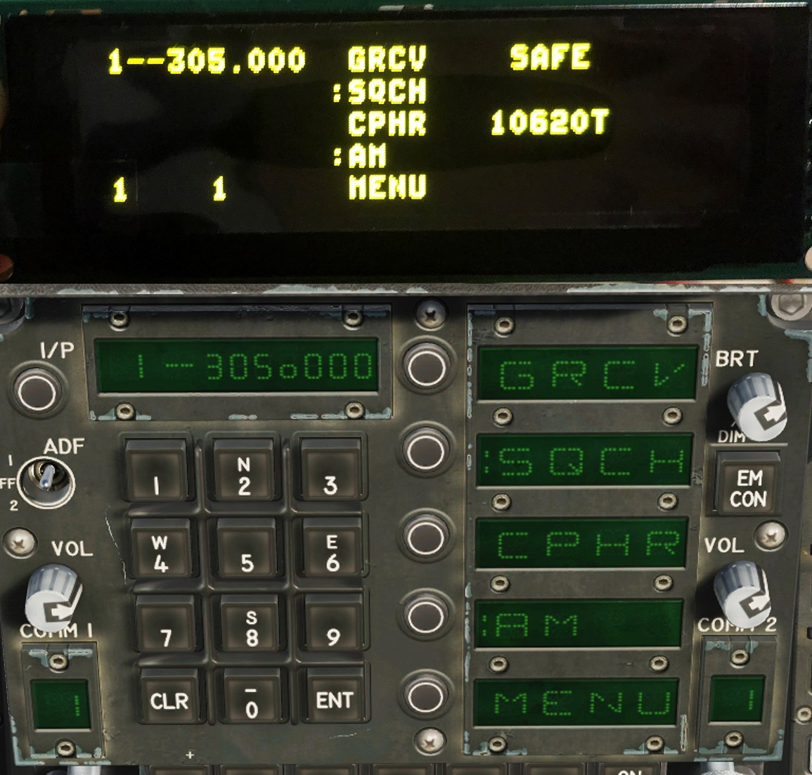
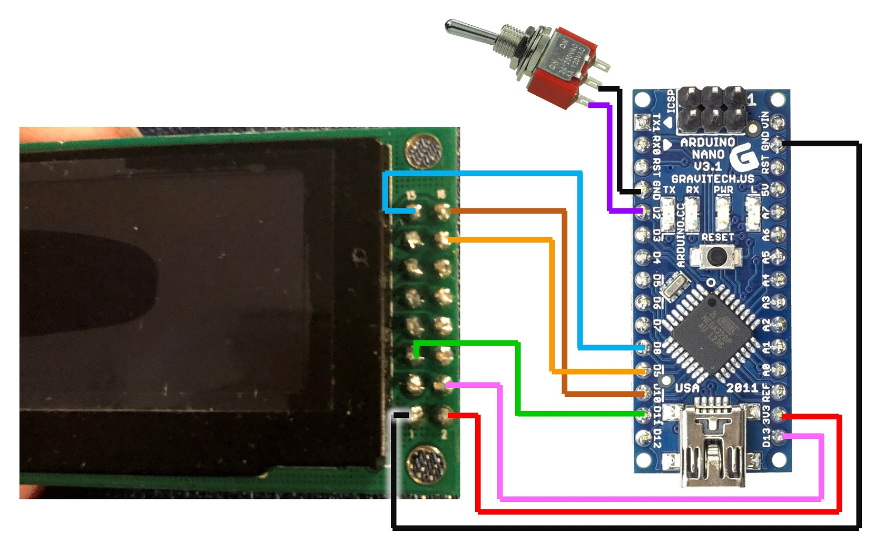
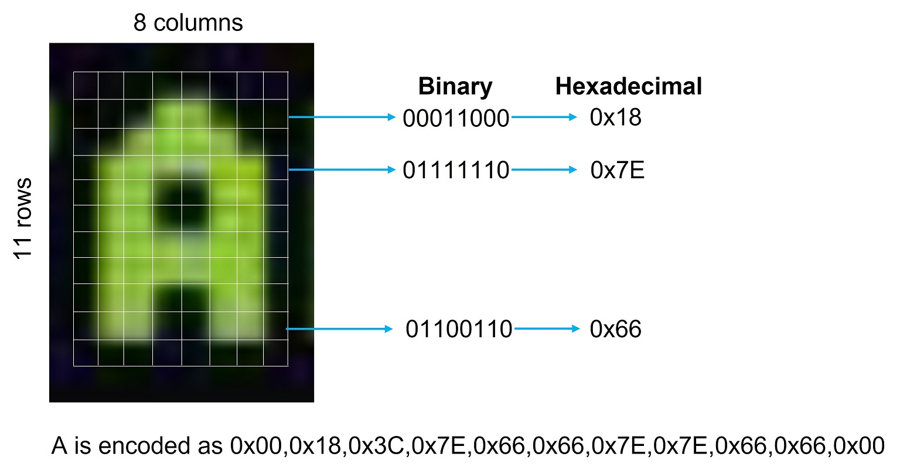
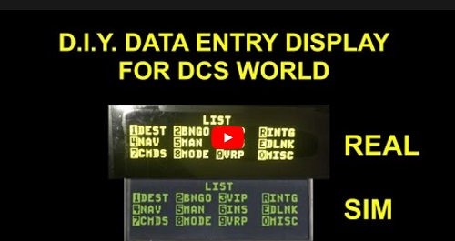

# DED
# Data Entry Display for DCS World 

DED v1.15 Created by James Storey, May 2022, https://github.com/jg-storey/ded  
Arduino code to display F-16 Data Entry Display and F/A-18 Upfront Controls information from DCS-BIOS
on a ER-OLEDM028-1 2.8" 256x64 OLED display from BuyDisplay.com
https://www.buydisplay.com/yellow-2-8-inch-arduino-raspberry-pi-oled-display-module-256x64-spi  
Tested with DCS-BIOS v0.10.0
https://github.com/dcs-bios/dcs-bios/releases
 
A toggle switch (i.e. not a pushbutton) wired between pin D2 and GND allows the user to select between F-16 and F/A-18 modes.
If a switch is not connected, the mode defaults to the F-16.

 
The F/A-18 display also includes a fuel reading and a master arm indicator. 
There is still some space to add other items in both modes.

## Changelog
### v1.15
- Uses an interrupt to change the mode. This means that the connection to DCS-BIOS no longer needs to be reset after changing modes.
- Added antenna symbols that appear in place of the radio channel number during transmit/receive in the F/A-18.
- Changed LIST and MISC page detection method as the previous approach wasn't working in all circumstances.

## Known issues. 
- The DEST page in the LIST menu comes up blank. This appears to be an issue with DCS-BIOS.
- When entering data between the highlighted asterisks the field does not highlight. I haven't figured out how to do this yet.

# Hardware connection
    
  |  OLED  |  =>  |  Arduino Nano  |
  | :---:  |  :---:  | :---:  |
  |  1. GND  |   ->  |  GND  |
  |  2. VCC  |   ->  |  3.3V  | 
  |  4. SCL  |   ->  |  SCK  (D13)  | 
  |  5. SDI  |   ->  |  MOSI (D11)  | 
  |  14. DC  |   ->  |  D9  |
  |  15. RES |   ->  |  D8  |
  |  16. CS  |   ->  |  D10  |
  |Toggle switch   (optional) |   |   |
  |  1.      |   ->  |  D2   |
  |  2.      |   ->  |  GND  |

# Font

I created a custom font by inspecting screen captures of the in-game DED. It is stored as an array of hexadecimal values in the er_oled.h header file following the scheme shown below.

# Build Video
Note: this video shows operation with v1.0 code.  

